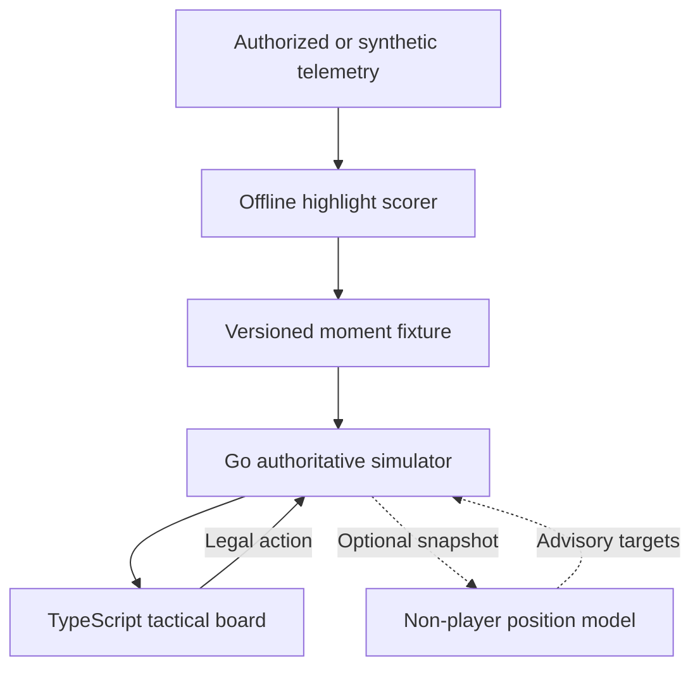

# Architecture

## Prototype boundary

The MVP is a shareable tactical board, not an in-game replay. It works entirely
from synthetic fixtures and uses high-level commands so it can later be adapted
to an authorized telemetry source without coupling the user interface to one
publisher's game engine.

## Determinism

Each fixture carries a stable seed. With the default built-in opponent policy,
the backend owns the random generator and all state transitions. The same
fixture and action sequence therefore produce the same state, score, and
terminal result. Invalid user actions leave the state unchanged.

An external position model may itself be nondeterministic. The engine therefore
retains each accepted response with its operator-configured model name/version
in session-scoped server memory. Durable reproduction additionally requires
exporting those records with the fixture and user action sequence; that storage
is deferred. Connector failures still produce a deterministic result by using
the seeded built-in policy.

## Information boundary

The full simulator state remains on the server. The returned `visible` flag is
the browser's display boundary; a production implementation should instead
serialize a filtered view that omits hidden coordinates altogether. The
prototype keeps coordinates in the synthetic response to make tests and
debugging inspectable, so it must not be described as anti-cheat hardened.

The optional position connector is also server-side and receives the unit snapshot. Its
URL is an operator configuration value, never a per-session user input. A
production deployment should require HTTPS, restrict outbound destinations,
authenticate the model service, minimize fields, and avoid sending hidden or
identity-bearing telemetry unless that use is explicitly authorized.

## AI boundary

The baseline highlight selector is an interpretable weighted score. A future
trajectory model may choose among legal high-level actions. The optional
position connector has an even narrower output: desired next-frame positions
for live units other than the player-controlled unit. This includes allied
teammates and opponents. The Go simulator rejects the complete response for an
unknown, controlled, dead, duplicate, or malformed unit suggestion; constrains
valid targets to map and class movement limits; and remains the only component
allowed to resolve movement, attacks, damage, cooldowns, visibility, scoring,
or victory state.
Optional natural-language commands should be parsed into the same action schema
and rejected unless valid.

## Position-model connector protocol

When `POSITION_MODEL_URL` is unset, no outbound request is made. When it is set,
`POSITION_MODEL_NAME` and `POSITION_MODEL_VERSION` are also required so accepted
results can be attributed; missing identity fails configuration at startup. The
deprecated `OPPONENT_MODEL_*` aliases are accepted only as one complete
environment-name group and cannot be mixed with the preferred names. They do
not select the retired opponent-only protocol; the endpoint must implement
schema `1.1`.
Each accepted user turn produces one HTTP `POST` containing `sessionId`,
`momentId`, `turn`, the map bounds, `controlledUnitId`, and the current units.
The request is versioned as `schemaVersion: "1.1"` and explicitly marked
`stateScope: "authoritative_server_state"`. Here `turn` is the one-based index
of the next frame being resolved. The model returns a required `positions`
array of unit IDs and complete `x`/`y` points.

The connector response is advisory. Missing teammate targets hold position;
missing opponent targets use built-in chase behavior. A timeout, transport
error, non-200 status, oversized/malformed JSON, or any response that cannot be
safely applied rejects the full response and activates the deterministic policy. The
wire contract is documented as the `positionModelTurn` webhook in
[`../contracts/openapi.yaml`](../contracts/openapi.yaml).

After all eligibility and coordinate checks pass, the engine records the exact
accepted target array, session/moment/turn keys, and configured model identity.
Rejected responses are never recorded as accepted. These rollout records are
privileged internal metadata, are cleared on reset, and are not serialized in
the browser-facing session response.

Frame resolution remains server-owned:

1. Validate the user's action and any target.
2. Apply the controlled unit's class-specific movement/action rule.
3. Request advisory non-player targets when the connector is enabled.
4. Validate the response atomically and clamp accepted targets, or run
   deterministic fallback behavior.
5. Resolve combat, cooldowns, visibility, scoring, and terminal state.

## Production components deferred

- Publisher-specific telemetry adapter and authorization
- Compact behavioral-cloning trajectory policy
- Durable export/storage for in-memory external-model rollout records
- Identity-aware pro-player style models
- Ranking evaluation with analyst-labelled pivotal moments
- Durable session storage, authentication, abuse controls, and rate limiting
- In-game engine integration and publisher approval
