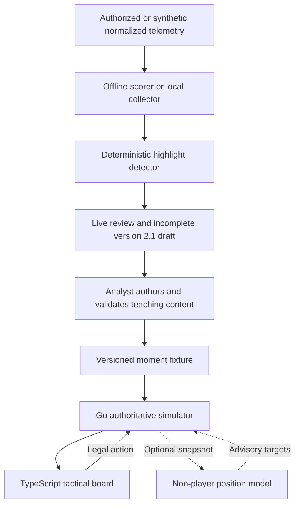

# Architecture

## Prototype boundary

The MVP is a shareable tactical board, not an in-game replay. It works entirely
from synthetic fixtures and uses high-level commands so it can later be adapted
to an authorized telemetry source without coupling the user interface to one
publisher's game engine.

## Determinism

Each fixture carries a stable seed. With the default built-in non-player policies,
the backend owns the random generator and all state transitions. The same
fixture and action sequence therefore produce the same state, score, and
terminal result. Invalid user actions leave the state unchanged.

An external position model may itself be nondeterministic. The engine therefore
retains each accepted response with its operator-configured model name/version
in session-scoped server memory. Durable reproduction additionally requires
exporting those records with the fixture and user action sequence; that storage
is deferred. Connector failures still produce a deterministic result by using
the seeded built-in policy.

## Information boundary

The full simulator state remains on the server. Public session responses omit
hidden enemy units entirely, including their coordinates and statistics, and
instead return visible and unknown enemy counts. Terrain can block long-range
vision, and reveal events are logged only when a blue unit obtains vision.
This is a meaningful information boundary, but it is still a prototype rather
than an anti-cheat-hardened production service.

The optional position connector is also server-side and receives the unit snapshot. Its
URL is an operator configuration value, never a per-session user input. A
production deployment should require HTTPS, restrict outbound destinations,
authenticate the model service, minimize fields, and avoid sending hidden or
identity-bearing telemetry unless that use is explicitly authorized.

## AI boundary

The baseline highlight selector is an interpretable weighted score. A future
trajectory model may choose among legal high-level actions. The optional
position connector has an even narrower output: desired next-frame positions
for live units other than the player-controlled unit. This includes allied
teammates and opponents. The Go simulator rejects the complete response for an
unknown, controlled, dead, duplicate, or malformed unit suggestion; constrains
valid targets to map and class movement limits; and remains the only component
allowed to resolve movement, attacks, damage, cooldowns, visibility, scoring,
or victory state.
Optional natural-language commands should be parsed into the same action schema
and rejected unless valid.

## Position-model connector protocol

When `POSITION_MODEL_URL` is unset, no outbound request is made. When it is set,
`POSITION_MODEL_NAME` and `POSITION_MODEL_VERSION` are also required so accepted
results can be attributed; missing identity fails configuration at startup. The
deprecated `OPPONENT_MODEL_*` aliases are accepted only as one complete
environment-name group and cannot be mixed with the preferred names. They do
not select the retired opponent-only protocol; the endpoint must implement
schema `1.1`.
Each accepted user turn produces one HTTP `POST` containing `sessionId`,
`momentId`, `turn`, the map bounds, `controlledUnitId`, and the current units.
The request is versioned as `schemaVersion: "1.1"` and explicitly marked
`stateScope: "authoritative_server_state"`. Here `turn` is the one-based index
of the current frame being resolved. The model returns a required `positions`
array of unit IDs and complete `x`/`y` points.

The connector response is advisory. Missing teammate targets hold position;
missing opponent targets use built-in chase behavior. A timeout, transport
error, non-200 status, oversized/malformed JSON, or any response that cannot be
safely applied rejects the full response and activates the deterministic policy. The
wire contract is documented as the `positionModelTurn` webhook in
[`../contracts/openapi.yaml`](../contracts/openapi.yaml).

After all eligibility and coordinate checks pass, the engine records the exact
accepted target array, session/moment/turn keys, and configured model identity.
Rejected responses are never recorded as accepted. These rollout records are
privileged internal metadata, are cleared on reset, and are not serialized in
the browser-facing session response.

Frame resolution remains server-owned:

1. Validate the user's action and any target.
2. Apply the controlled unit's class-specific movement/action rule.
3. Request advisory non-player targets when the connector is enabled.
4. Validate the response atomically and clamp accepted targets, or run
   deterministic fallback behavior.
5. Resolve combat, cooldowns, visibility, scoring, and terminal state.

## Production components deferred

- Publisher-specific telemetry adapter and authorization
- Compact behavioral-cloning trajectory policy
- Durable export/storage for in-memory external-model rollout records
- Identity-aware pro-player style models
- Held-out authorized-match ranking calibration beyond the synthetic regression pack
- Durable simulator-session storage, authentication, and network-wide abuse controls
- In-game engine integration and publisher approval

## Local live telemetry boundary

The Go API includes a bounded, process-local telemetry registry for normalized
frames plus a durable local store for finalized summaries and analyst drafts.
An ephemeral collector credential protects ordered frame ingestion;
the browser receives minimized match summaries, canonical detector signals,
candidate evidence, and a separate bounded visual trace. The trace uses stable
A/B aliases and includes only normalized positions, alive state, time, and
aggregated normalized events. Raw IDs, health, gold, frames, movement traces,
and tokens are not persisted. Detector evidence is converted to stable A/B
aliases before a summary or draft reaches disk. Seven-day retention, selectable
`1..365` day cleanup, single-match deletion, and delete-all controls are exposed
through the same loopback API. A detected candidate cannot enter the authored library
directly: it first becomes an incomplete draft guarded by the existing analyst
authorship and acceptance-test validator.

See [`live-telemetry.md`](live-telemetry.md) for the local journey and exact
privacy, finalization, and publication boundaries.

## Authored simulation rules

Fixture version 2.1 declares unit combat statistics and policies, terrain,
vision, objectives, escape routes, explicit victory conditions, and reference
plans. The server resolves a turn in this order: cooldown and defense reset,
user action, allied policies, enemy policies, visibility, objective and escape
progress, state-derived advantage, then terminal conditions.

Reference advice is withheld until the user commits. Complete deterministic
rollouts for all legal first actions are returned only when the scenario
ends. They are labelled as authored baselines rather than historical outcomes.
