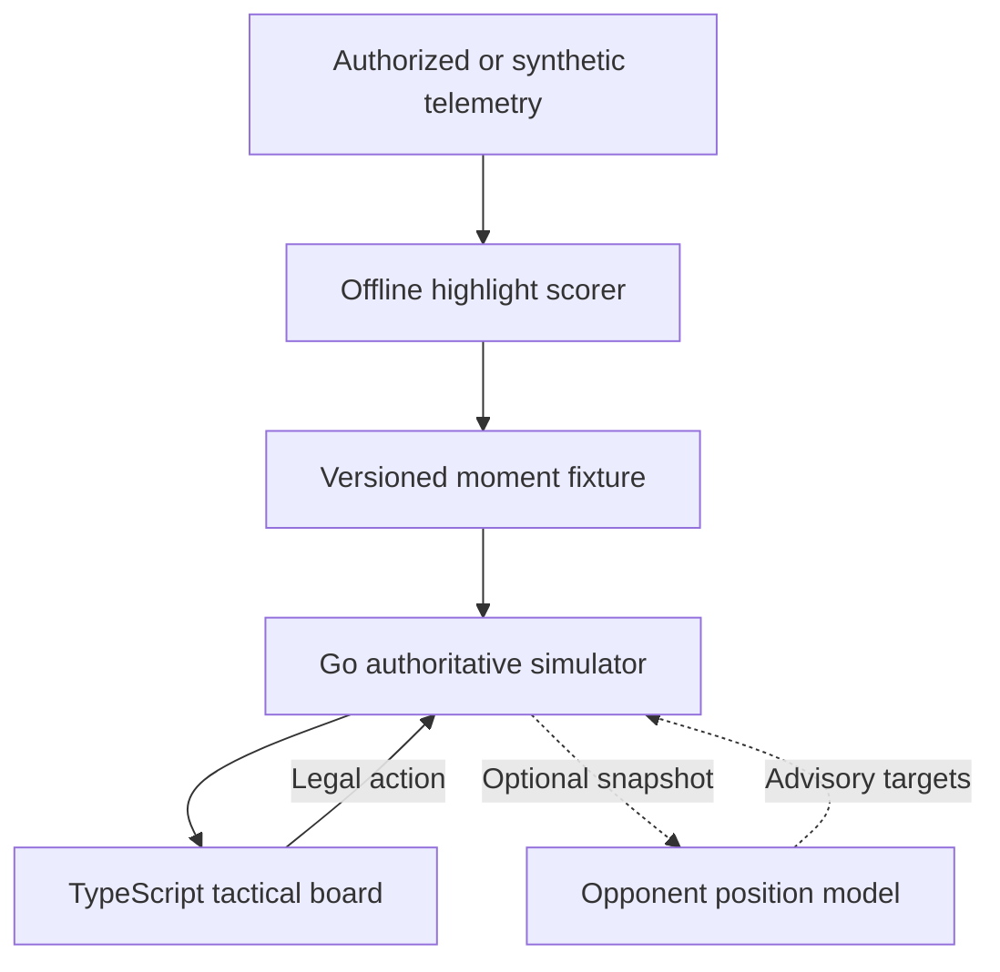

# Architecture

## Prototype boundary

The MVP is a shareable tactical board, not an in-game replay. It works entirely
from synthetic fixtures and uses high-level commands so it can later be adapted
to an authorized telemetry source without coupling the user interface to one
publisher's game engine.

## Determinism

Each fixture carries a stable seed. With the default built-in opponent policy,
the backend owns the random generator and all state transitions. The same
fixture and action sequence therefore produce the same state, score, and
terminal result. Invalid user actions leave the state unchanged.

An external position model may itself be nondeterministic. Exact reproduction
of a model-connected production run therefore requires recording the accepted
model responses together with the endpoint/model version, or deploying a
deterministic model. Connector failures still produce a deterministic result by
using the seeded built-in policy.

## Information boundary

The full simulator state remains on the server. The returned `visible` flag is
the browser's display boundary; a production implementation should instead
serialize a filtered view that omits hidden coordinates altogether. The
prototype keeps coordinates in the synthetic response to make tests and
debugging inspectable, so it must not be described as anti-cheat hardened.

The optional connector is also server-side and receives the unit snapshot. Its
URL is an operator configuration value, never a per-session user input. A
production deployment should require HTTPS, restrict outbound destinations,
authenticate the model service, minimize fields, and avoid sending hidden or
identity-bearing telemetry unless that use is explicitly authorized.

## AI boundary

The baseline highlight selector is an interpretable weighted score. A future
trajectory model may choose among legal high-level actions. The optional
opponent connector has an even narrower output: desired next-frame positions
for opponent units. The Go simulator rejects unknown, allied, controlled, dead,
duplicate, or malformed unit suggestions; constrains valid targets to map and
class movement limits; and remains the only component allowed to resolve
movement, attacks, damage, cooldowns, visibility, scoring, or victory state.
Optional natural-language commands should be parsed into the same action schema
and rejected unless valid.

## Opponent connector protocol

When `OPPONENT_MODEL_URL` is unset, no outbound request is made. When it is set,
each accepted user turn produces one HTTP `POST` containing `sessionId`,
`momentId`, `turn`, the map bounds, `controlledUnitId`, and the current units.
The request is versioned as `schemaVersion: "1.0"` and explicitly marked
`stateScope: "authoritative_server_state"`. Here `turn` is the one-based index
of the next frame being resolved. The model returns a required `positions`
array of unit IDs and complete `x`/`y` points.

The connector response is advisory. Missing opponent targets use built-in
behavior. A timeout, transport or HTTP error, oversized/malformed JSON, or a
response that cannot be safely applied activates the deterministic policy. The
wire contract is documented as the `opponentModelTurn` webhook in
[`../contracts/openapi.yaml`](../contracts/openapi.yaml).

Frame resolution remains server-owned:

1. Validate the user's action and any target.
2. Apply the controlled unit's class-specific movement/action rule.
3. Request advisory opponent targets when the connector is enabled.
4. Validate and clamp accepted targets, or run deterministic fallback behavior.
5. Resolve combat, cooldowns, visibility, scoring, and terminal state.

## Production components deferred

- Publisher-specific telemetry adapter and authorization
- Compact behavioral-cloning trajectory policy
- Capture/replay storage for accepted external-model suggestions
- Identity-aware pro-player style models
- Ranking evaluation with analyst-labelled pivotal moments
- Durable session storage, authentication, abuse controls, and rate limiting
- In-game engine integration and publisher approval
