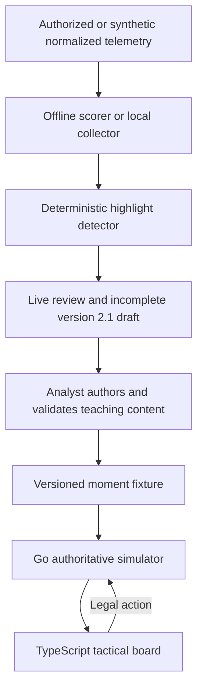

# Architecture

## Prototype boundary

The MVP is a shareable tactical board, not an in-game replay. It works entirely
from synthetic fixtures and uses high-level commands so it can later be adapted
to an authorized telemetry source without coupling the user interface to one
publisher's game engine.

## Determinism

Each fixture carries a stable seed. The backend owns the random generator and
all state transitions. The same fixture and action sequence therefore produce
the same state, score, and terminal result. Invalid actions leave the state
unchanged.

## Information boundary

The full simulator state remains on the server. Public session responses omit
hidden enemy units entirely, including their coordinates and statistics, and
instead return visible and unknown enemy counts. Terrain can block long-range
vision, and reveal events are logged only when a blue unit obtains vision.
This is a meaningful information boundary, but it is still a prototype rather
than an anti-cheat-hardened production service.

## AI boundary

The baseline highlight selector is an interpretable weighted score. A future
trajectory model may choose among legal high-level actions, but must never
author damage, positions, cooldown resolution, visibility, or victory state.
Optional natural-language commands should be parsed into the same action schema
and rejected unless valid.

## Production components deferred

- Publisher-specific telemetry adapter and authorization
- Compact behavioral-cloning trajectory policy
- Identity-aware pro-player style models
- Held-out authorized-match ranking calibration beyond the synthetic regression pack
- Durable simulator-session storage, authentication, and network-wide abuse controls
- In-game engine integration and publisher approval

## Local live telemetry boundary

The Go API includes a bounded, process-local telemetry registry for normalized
frames plus a durable local store for finalized summaries and analyst drafts.
An ephemeral collector credential protects ordered frame ingestion;
the browser receives minimized match summaries, canonical detector signals,
candidate evidence, and a separate bounded visual trace. The trace uses stable
A/B aliases and includes only normalized positions, alive state, time, and
aggregated normalized events. Raw IDs, health, gold, frames, movement traces,
and tokens are not persisted. Detector evidence is converted to stable A/B
aliases before a summary or draft reaches disk. Seven-day retention, selectable
`1..365` day cleanup, single-match deletion, and delete-all controls are exposed
through the same loopback API. A detected candidate cannot enter the authored library
directly: it first becomes an incomplete draft guarded by the existing analyst
authorship and acceptance-test validator.

See [`live-telemetry.md`](live-telemetry.md) for the local journey and exact
privacy, finalization, and publication boundaries.

## Authored simulation rules

Fixture version 2.1 declares unit combat statistics and policies, terrain,
vision, objectives, escape routes, explicit victory conditions, and reference
plans. The server resolves a turn in this order: cooldown and defense reset,
user action, allied policies, enemy policies, visibility, objective and escape
progress, state-derived advantage, then terminal conditions.

Reference advice is withheld until the user commits. Complete deterministic
rollouts for all four legal first actions are returned only when the scenario
ends. They are labelled as authored baselines rather than historical outcomes.
