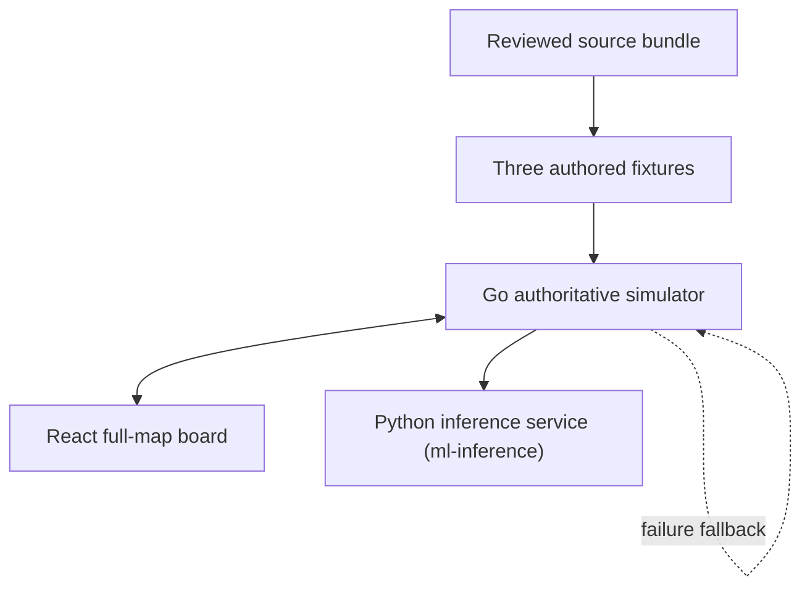

# Architecture

## Product boundary

Playable Replays is a web prototype for three short tactical teaching
scenarios. It is a full-map simulator, not an in-game
replay, live telemetry product, or proprietary game-engine implementation.

The scenario evidence comes from the supplied T1–Bilibili Gaming Worlds 2024
review bundle. Fixture evidence anchors the teaching premise to reviewed video,
captions, and event sources. Unit, terrain, objective, turret, and target
coordinates are authored on a normalized `0..100` map. They are approximations
informed by reviewed minimap frames, **not replay telemetry or claims of exact
historical positions**.

There is no runtime source ingestion or scenario drafting path. Adding or
changing a scenario is an offline, analyst-reviewed fixture change.

## Component ownership

| Component | Owns | Must not own |
| --- | --- | --- |
| React frontend | Interaction, accessible controls, full-map rendering, range/stat display, timeline, logs, and debrief | Legality, hidden state, damage, model credentials, or fallback rules |
| Go API | Strict HTTP boundary, in-memory sessions, per-session locking, rate limits, and public-state filtering | Browser-only model calls or durable telemetry storage |
| Go engine | Movement, class limits, fog, combat, projectiles, Dodge, objectives, outcomes, references, and fallback | External model inference or replay-exact claims |
| Python inference service (`ml-inference`) | Evaluate the exported 72-feature linear policy and return advisory bot actions | Authoritative state mutation, retries, training, or browser access |
| Fixture pack | Three teaching states, source evidence, authored rules, reference lines, and acceptance cases | Raw media, secrets, or claimed measured map coordinates |

The browser talks only to the Go API. The model-service URL and identity are
operator-owned startup configuration; a session or browser request can never
select an arbitrary outbound URL.

## Tactical-turn flow

1. React submits `move`, `hold`, `contest`, or `retreat` to
   `POST /api/v1/sessions/{id}/turns`.
2. Go validates the complete action before mutating state.
3. Go resets per-turn defense, ticks cooldowns, increments the turn, and
   resolves any projectile left pending from the previous turn.
4. If the controlled unit survives, Go resolves its command and visibility.
5. When configured, Go sends one privileged schema `2.0` snapshot to the
   inference service. The snapshot includes the legal four-action set, all
   units, objective state, projectiles, and `controlledUnitId`.
6. The service evaluates the exported policy for every live non-controlled unit.
7. Go validates the response atomically. A complete valid response supplies bot
   intent; any failure uses built-in fallback actions for the whole turn.
8. Go resolves allied and enemy behavior, visibility, objective/escape state,
   rules-based advantage, the universal 2:1 team-health terminal check, and
   reference output. If the controlled unit falls before that threshold,
   control transfers deterministically to a surviving teammate.
9. React receives a complete public `Session` snapshot.

Move targets from the model are bounded to `0..100` and then constrained by
each unit's server-owned class movement range during resolution. The model can
never set health, damage, cooldowns, visibility, projectile results, advantage,
or terminal state.

The fixture's `maxTurns` is an authored coaching/reference horizon rather than
a live-play cap. The API continues accepting the same four commands after that
horizon while the session remains active. Only summed remaining team health can
finish play: a team wins once it has at least twice its opponent's total HP.

## Dodge flow

Dodge is a reaction, not a tactical action. React calls
`POST /api/v1/sessions/{id}/dodge` only when `dodgeAvailable` is true. Go checks
that the active controlled unit has a charge and an incoming red projectile,
removes one eligible projectile, applies a class-limited automatic sidestep,
decrements `dodgeCharges`, updates the log, and returns the session. It does not
increment `turn`, call the model, or advance objectives/cooldowns.

The session starts with two charges. A pending projectile that is not dodged is
resolved at the beginning of the next accepted tactical turn, before the user
command. This keeps the reaction visible and immediate without adding Dodge to
the four-way decision tree.

## Authority, determinism, and failure

The Go engine is the sole authority. With no configured model, a fixture seed
and tactical action sequence produce the same trajectory apart from the session
ID. Invalid user input leaves state unchanged.

Accepted model-service responses are retained with model name/version in
in-memory rollout records; durable exact replay of a model-backed session would
also require exporting those records and the user's actions, which is deferred.
A timeout, transport error, non-200, incomplete response, malformed JSON,
illegal action, unknown or duplicate unit, or invalid target rejects the model
response. The turn remains available through fallback, whose behavior is
deterministic for the same seed and tactical action sequence.

`Session.botControl` makes that boundary visible:

| Source | Meaning |
| --- | --- |
| `pending` | A model service is configured, but no tactical turn has completed. |
| `external-model` | Every live non-controlled unit received an accepted model action; name/version are included. |
| `fallback` | No model service is configured, or its response failed closed. |

## Information and security boundary

Public sessions omit hidden red units and expose only visible/unknown enemy
counts. Red projectile source IDs are also removed when the source is hidden.
The model snapshot is more privileged: it contains authoritative units because
the model is acting for all bots. It must go only to an operator-controlled
service under an explicit data-use and retention policy.

The inference service never logs snapshots or model output. Requests and
responses are bounded, the backend client has a fixed deadline, and neither
service retries model calls. Production use still needs authenticated
service-to-service transport, allowlisted egress,
secret management, session authentication, durable storage decisions, and
publisher review.

## Full-map state

The engine owns inclusive `0..100` geometry and returns the full map rather than
focused scenario viewports. Every session contains exactly six canonical
turrets: blue/red top, middle, and bottom. Turrets have server-supplied
`hp/maxHp/alive` state and are currently visual landmarks; they do not attack or
receive simulated damage. React renders server data and does not duplicate
turret locations as gameplay truth.

Unit class profiles define health, move range, and attack range. Fog still
filters hidden enemies from public session units. Marksman attacks create a
one-turn `Projectile`; the target path is visible in the public session, subject
to source-ID redaction for hidden red marksmen.

## Deferred production work

- Publisher-authorized data ingestion and replay adapters
- Authentication, durable simulator sessions, and network-wide abuse controls
- Authenticated/encrypted model-service transport and egress allowlists
- Durable export of accepted model actions for exact replay
- Calibrated learned outcome estimates and representative evaluation data
- Navmesh/collision and publisher-specific abilities, items, and timing
- In-game integration and publisher approval
