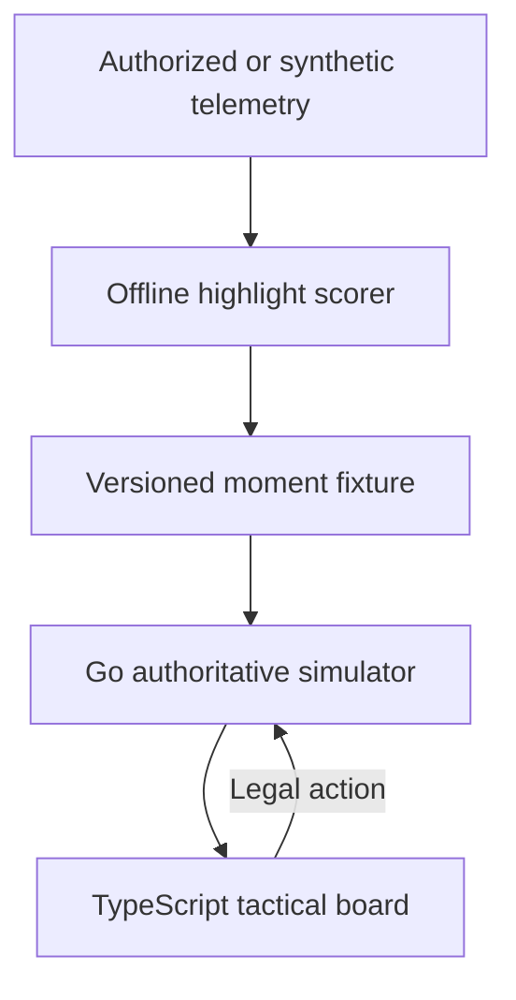

# Architecture

## Prototype boundary

The MVP is a shareable tactical board, not an in-game replay. It works entirely
from synthetic fixtures and uses high-level commands so it can later be adapted
to an authorized telemetry source without coupling the user interface to one
publisher's game engine.

## Determinism

Each fixture carries a stable seed. The backend owns the random generator and
all state transitions. The same fixture and action sequence therefore produce
the same state, score, and terminal result. Invalid actions leave the state
unchanged.

## Information boundary

The full simulator state remains on the server. The returned `visible` flag is
the browser's display boundary; a production implementation should instead
serialize a filtered view that omits hidden coordinates altogether. The
prototype keeps coordinates in the synthetic response to make tests and
debugging inspectable, so it must not be described as anti-cheat hardened.

## AI boundary

The baseline highlight selector is an interpretable weighted score. A future
trajectory model may choose among legal high-level actions, but must never
author damage, positions, cooldown resolution, visibility, or victory state.
Optional natural-language commands should be parsed into the same action schema
and rejected unless valid.

## Production components deferred

- Publisher-specific telemetry adapter and authorization
- Compact behavioral-cloning trajectory policy
- Identity-aware pro-player style models
- Ranking evaluation with analyst-labelled pivotal moments
- Durable session storage, authentication, abuse controls, and rate limiting
- In-game engine integration and publisher approval

