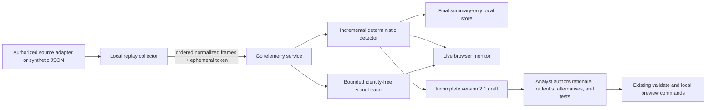

# Local live telemetry

The local telemetry workflow replays a normalized, authorized or synthetic
match into the Go API and shows deterministic highlight candidates in the
Match Telemetry screen. The dashboard also renders an identity-free tactical
timeline with anonymous movement tracks, normalized events, the detected
window, and any team-fight reversal timestamp. It does not decode a publisher replay and it does not
accept account IDs, player names, chat, or raw packets.

## Run the included journey

Start the API and web app in separate terminals:

```bash
make dev-api
make dev-web
```

Open the Match Telemetry section. In a third terminal, replay the included
identity-free sample:

```bash
cd backend
go run ./cmd/telemetry-collector \
  --input ../fixtures/telemetry-demo.json \
  --source synthetic \
  --rate 4
```

Use `--rate 0` for an immediate test or `--rate 1` for the source timeline's
speed. The collector prints the local match ID and final candidate count. It
never prints the collector credential.

## Flow and trust boundaries



- Match creation requires `consent: true` and a `synthetic` or `authorized`
  source label.
- The API returns an ephemeral bearer token used only to send frames and end
  that local capture. The browser does not receive it. Finalization discards
  the token from memory, and the local store has no field capable of accepting
  it.
- Input uses the strict version `1.0` normalized telemetry contract. Unknown
  fields, unknown event types, roster drift, duplicate or out-of-order times,
  and out-of-order batch sequences are rejected without changing match state.
- Batches contain at most 16 frames and a match at most 10,000 frames. The
  process holds at most 32 live matches and does not persist raw frames or
  credentials to disk.
- The visual trace is a separate read boundary. It replaces source unit/team
  IDs with stable `A1`, `A2`, `B1` aliases; exposes only side, normalized
  position, alive state, time, and normalized event counts; and omits health,
  gold, source IDs, and credentials.
- At most 180 visual frames and 240 event markers are returned. Long matches
  are progressively and deterministically downsampled while the latest frame
  is always retained. The response declares `sampleEvery` and `truncated` so
  the UI does not imply that a sampled trace is complete.
- The detector evaluates fully covered 12-second windows every two seconds and
  uses the same score, tags, semantic evidence, and overlap rules as the
  offline Python detector.
- Candidates stay `provisional` while frames arrive and become `final` only
  after the collector finishes the replay.

## Local storage and deletion

Finalization saves an identity-free match summary under `LOCAL_DATA_DIR`; draft
creation and each analyst save write a separate local draft file. The default
directory is `../.local-data` when the API runs from `backend/`, and it is
ignored by Git. Docker Compose uses a local named volume.

Only the following survive a restart:

- match ID, synthetic/authorized source class, final status, frame count, and
  anonymous detector candidates;
- detector score, signals, labels, timestamps, and evidence after source unit
  IDs have been replaced by stable `A1`/`B1` aliases;
- analyst-authored version 2.1 draft content and its validation state.

Raw normalized frames, source roster identifiers, health/gold samples, the
visual movement trace, and collector credentials remain memory-only. A restored
summary therefore sets `timelineAvailable: false`, and the dashboard explains
why movement cannot be replayed after restart.

The dashboard can retain safe files for 1, 7, 30, 90, or 365 days, delete one
match and its drafts, or delete all local telemetry. The API enforces the wider
`1..365` day range. The default is seven days and is saved in the local storage
settings file. `LOCAL_DATA_RETENTION_DAYS` supplies the first-run default.

## Analyst publication gate

The browser can create a draft only from a final candidate. The response
preserves detector schema version, timestamps, score, reason tags, signal
values, and semantic evidence in a version `2.1` draft. The generated draft is
always marked `incomplete`.

The review queue opens that draft in a local analyst workbench. It supports the
lesson title, description, map, difficulty, synthetic units, terrain,
mechanics, deterministic rules, rationale, tradeoffs, alternatives, and
win/loss acceptance tests. Detector-derived identity and evidence remain
read-only. Every save returns field-level issues and, once the fixture shape is
valid, the result of each deterministic acceptance test.

`Preview locally` and `Export review pack` remain disabled until the complete
fixture validator passes and the authored win and loss tests reproduce their
expected terminal results. Preview creates only an ephemeral simulator
session. Export returns a separate version `2.1` pack and never writes to
`fixtures/moments.json`.

The existing fixture publication command still refuses that draft until an
analyst supplies all of the following:

- tactical rationale;
- intended tradeoffs;
- plausible alternatives;
- executable win/loss acceptance tests.

The command-line workflow in
[`telemetry-scenario-drafts.md`](telemetry-scenario-drafts.md) remains available
for offline NDJSON drafts. Neither workflow has an automatic route from live
detection to the authored scenario library.

## API summary

| Endpoint | Purpose |
| --- | --- |
| `POST /api/v1/telemetry/matches` | Start a consented ephemeral match and issue its collector token. |
| `POST /api/v1/telemetry/matches/{id}/frames` | Accept one ordered normalized batch and run incremental detection. |
| `POST /api/v1/telemetry/matches/{id}/finish` | Finalize the replay and candidates. |
| `GET /api/v1/telemetry/matches` | List local matches for the dashboard. |
| `DELETE /api/v1/telemetry/matches` | Delete all in-memory telemetry, saved summaries, and drafts. |
| `GET /api/v1/telemetry/matches/{id}` | Read one current match snapshot. |
| `DELETE /api/v1/telemetry/matches/{id}` | Delete one match and its saved drafts. |
| `GET /api/v1/telemetry/matches/{id}/timeline` | Read the bounded identity-free movement and event trace. |
| `GET /api/v1/telemetry/matches/{id}/events` | Receive server-sent live match snapshots. |
| `POST /api/v1/telemetry/matches/{id}/candidates/{candidateId}/draft` | Create an explicitly incomplete analyst draft from a final candidate. |
| `GET /api/v1/telemetry/matches/{id}/candidates/{candidateId}/draft` | Reopen the local draft and its validation state. |
| `PUT /api/v1/telemetry/matches/{id}/candidates/{candidateId}/draft` | Save editable fields while rejecting detector-evidence changes. |
| `POST /api/v1/telemetry/matches/{id}/candidates/{candidateId}/draft/validate` | Run field checks and deterministic win/loss acceptance tests. |
| `POST /api/v1/telemetry/matches/{id}/candidates/{candidateId}/draft/preview` | Create an ephemeral session for a fully valid draft. |
| `POST /api/v1/telemetry/matches/{id}/candidates/{candidateId}/draft/review-pack` | Return a separate validated pack without modifying the authored library. |
| `GET /api/v1/local-storage` | Read summary/draft counts and the current retention policy. |
| `PUT /api/v1/local-storage/retention` | Change retention and immediately remove expired safe files. |

The full request and response shapes are in
[`contracts/openapi.yaml`](../contracts/openapi.yaml).

## What remains source-specific

A production adapter must independently establish publisher permission,
capture authorization, patch semantics, event correctness, retention policy,
and deletion controls before mapping data into the normalized contract. No
publisher-specific decoder should be added until the team records the approved
provider, API or replay format, permitted fields, credentials flow, and storage
terms. That decoder must remain outside the simulator and emit only the existing
normalized version 1.0 telemetry contract. The included collector is a local
contract proof, not that adapter.
